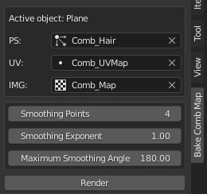
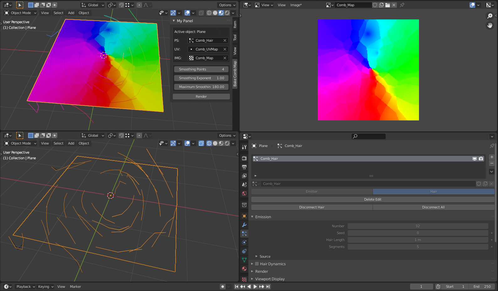

Work in progress.

Adds a tab to the tools panel that lets you bake hair particle combing direction into a texture map.

# Installation

Use the .zip from the latest release and follow the instructions on the page.

# Usage

| Label  | Description |
| ------------- |:-------------|
|Active Object| The currently selected object|
|PS| The **hair** particle system to be baked|
|UV| The UV map that will be used for placing pixels into the image. Be sure to use a UV map with no overlap.|
|IMG| The image file that will contain the baked data|
|||
|Smoothing Points|The number of nearby points to use for smoothing the voronoi image|
|Smoothing Exponent|The exponent used for smoothing blending. 1 gives a linear gradient while higher numbers make the blending sharper.|
|Maximum Smoothing Angle| The maximum angle difference to attempt to smooth between points. 2 hairs pointing in opposite directions would have an angle difference of 180 degrees. 2 perpendicular hairs would be at 90 degrees. The default value of 180 degrees means that all hair angles can be blended.|

# Example

